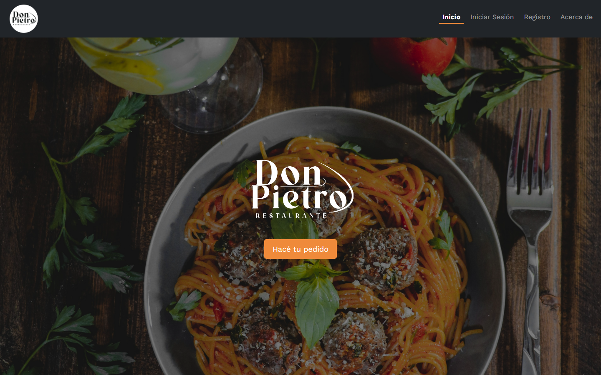

# Don Pietro

A MERN web app for a fast-food restaurant: customers browse the menu and order from their table, and staff run the whole order pipeline from an admin panel.

**Live demo:** https://donpietro.netlify.app



## Features

**For customers**

- Register and log in (JWT sessions, Google reCAPTCHA, confirmation email via EmailJS)
- Browse the menu and build a cart with live stock checks (capped at 30 units per product)
- Place an order for a table, with optional comments
- "My account" page with personal order history
- Contact form (EmailJS + reCAPTCHA) and an interactive location map (Leaflet)

**For staff (admin routes)**

- Order pipeline: waiting for payment, preparing, pending delivery; completed orders move to an order history
- TV panel view listing current orders by status
- Product management: create, edit and delete products (category, stock, vegan/vegetarian flags)
- User management: delete users and change account type; a super admin cannot be removed by an admin
- Restaurant configuration, such as the number of tables

## Tech stack

| Layer | Tech |
| --- | --- |
| Frontend (this repo) | React 18, Vite, React Router, TanStack Query, Zustand, React Hook Form, Bootstrap 5, Leaflet, EmailJS, reCAPTCHA, Sonner, SweetAlert2 |
| Backend ([backendDonPietro](https://github.com/AnabelaGuillermo/backendDonPietro)) | Node.js, Express, MongoDB with Mongoose, JWT, bcryptjs, Joi validation, esbuild |

## Team

- [Santiago Puertas](https://github.com/SantiagoPuertas4), Lead developer
- [Anabela Guillermo](https://github.com/AnabelaGuillermo)
- [Benjamin Gimenez](https://github.com/BenjaminGimenez)
- [Ignacio Sal Paz](https://github.com/nachosalpaz)

## My role

- Set up the frontend project and led development as the most active committer in both repos.
- Built the admin panel: product list and create/edit forms, user list with role changes and deletion, and restaurant configuration.
- Designed the order flow end to end: order and order-history models, status-based endpoints and stock control on the backend, plus the payment, preparing, delivery and TV panel views on the frontend.
- Wrote the backend auth and access layer: login endpoint and the `isAuthenticated`, `isAdmin`, `validateBody` and duplicate-check middlewares, including super admin protection.
- Added form security and integrations: reCAPTCHA on login, register and contact, EmailJS for registration and contact emails, and the Leaflet location map.

## Getting started

Requires Node.js and a running instance of the [backend](https://github.com/AnabelaGuillermo/backendDonPietro).

```bash
git clone https://github.com/SantiagoPuertas4/frontendDonPietro.git
cd frontendDonPietro
npm install
cp .env.sample .env   # then fill in the values
npm run dev
```

### Environment variables

| Variable | Purpose |
| --- | --- |
| `VITE_BACKEND_URL` | Base URL of the backend API |
| `VITE_CAPTCHA_KEY` | Google reCAPTCHA site key |
| `VITE_MAIL_SERVICE_ID` | EmailJS service ID |
| `VITE_MAIL_TEMPLATE_REGISTER_ID` | EmailJS template for registration emails |
| `VITE_MAIL_TEMPLATE_CONTACT_ID` | EmailJS template for the contact form |
| `VITE_MAIL_PUBLIC_KEY` | EmailJS public key |

### Scripts

| Command | Description |
| --- | --- |
| `npm run dev` | Start the Vite dev server |
| `npm run build` | Build for production |
| `npm run preview` | Preview the production build |
| `npm run lint` | Run ESLint |

## Context

RollingCode School final project, built by a team of 4 in August 2024.
